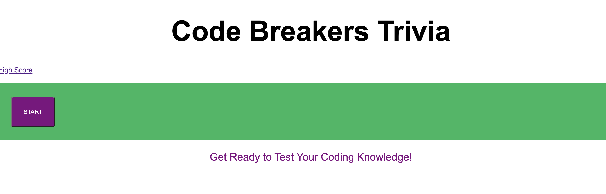

## Description
This quiz tests users on their coding knowledge! The quiz buttons have been dynamically created and will deduct five seconds from the time if a wrong answer is selected.  I struggled to log the user's score using localStorage and didn't complete that part of the requirements.  My highscores hyperlink works on my local computer, but I couldn't get it to deploy once uploaded to GitHub

## picture

## live url
https://abbyrosenthal.github.io/Code-Trivia/